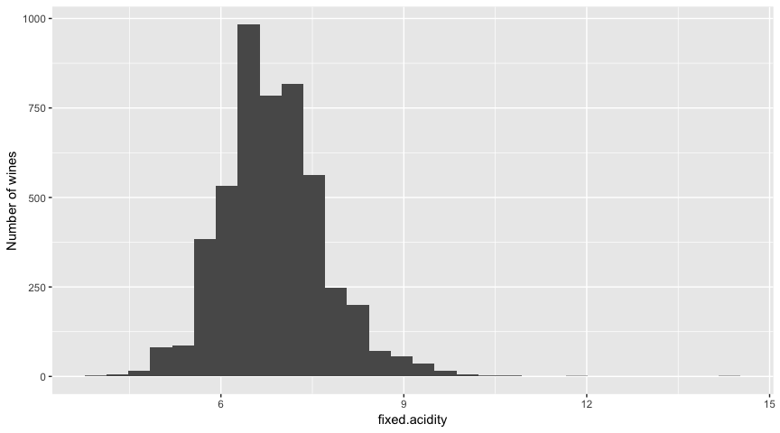
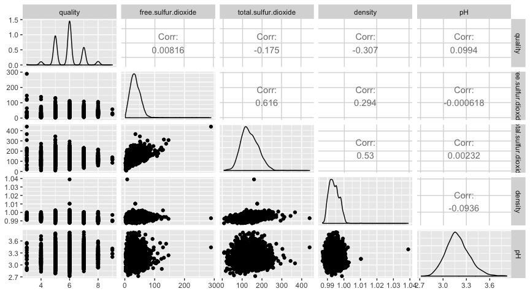
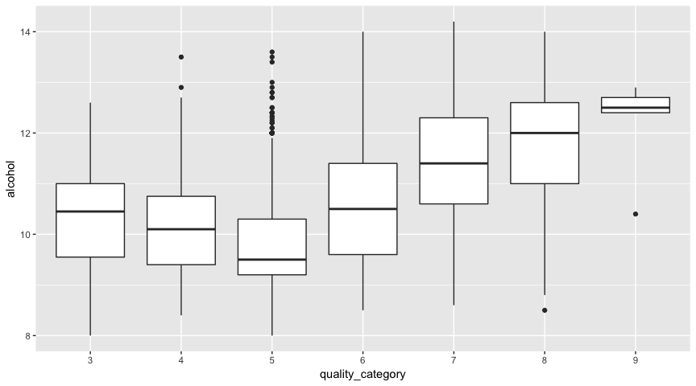

An EDA of White Wine Data by Pranath Fernando
================
Pranath Fernando
November 11th, 2018

An EDA of White Wine Data by Pranath Fernando
=============================================

Introduction
------------

In this exploration I will be examining a data set of white wine data to try to determine which chemical properties of wine may be useful in helping to predict it's quality.

More info on this data set can be found here:

<https://s3.amazonaws.com/udacity-hosted-downloads/ud651/wineQualityInfo.txt>

Some research into the literature regarding chemical factors that can effect wine quality such as:

-   <https://www.researchgate.net/publication/276424645_Prediction_of_Wine_Sensorial_Quality_by_Routinely_Measured_Chemical_Properties>
-   <https://www.hindawi.com/journals/tswj/2012/249041/>
-   <https://naramatawine.files.wordpress.com/2015/03/winemaking-uof-c-davis.pdf>

These suggest that the following chemical factors may play a role in determining wine quality:

-   Sulphur dioxide
-   ph
-   Density
-   Alcohol
-   Non-volatile acids
-   Total acids

These chemical qualities will guide the primary features of interest in the given data set for this exploration.

The dataset consists of 4898 observations of 13 variables which are:

-   **fixed.acidity**
-   **volatile.acidity**
-   **citric.acid**
-   residual.sugar
-   chlorides
-   **free.sulfur.dioxide**
-   **total.sulfur.dioxide**
-   **density**
-   **pH**
-   sulphates
-   **alcohol**
-   **quality**

Variables to be explored highlighted in bold.

Univariate Plots
----------------

``` r
# Load initial libraries install.packages('ggplot2')
library(ggplot2)
# install.packages('GGally')
library(GGally)

# Set seed so results are reproducable
set.seed(1836)

# Load the Data
setwd("/Users/pranath/DataScience/r/eda_project/")
wine <- read.csv("wineQualityWhites.csv")

# Print out data types
str(wine)
```

    ## 'data.frame':    4898 obs. of  13 variables:
    ##  $ X                   : int  1 2 3 4 5 6 7 8 9 10 ...
    ##  $ fixed.acidity       : num  7 6.3 8.1 7.2 7.2 8.1 6.2 7 6.3 8.1 ...
    ##  $ volatile.acidity    : num  0.27 0.3 0.28 0.23 0.23 0.28 0.32 0.27 0.3 0.22 ...
    ##  $ citric.acid         : num  0.36 0.34 0.4 0.32 0.32 0.4 0.16 0.36 0.34 0.43 ...
    ##  $ residual.sugar      : num  20.7 1.6 6.9 8.5 8.5 6.9 7 20.7 1.6 1.5 ...
    ##  $ chlorides           : num  0.045 0.049 0.05 0.058 0.058 0.05 0.045 0.045 0.049 0.044 ...
    ##  $ free.sulfur.dioxide : num  45 14 30 47 47 30 30 45 14 28 ...
    ##  $ total.sulfur.dioxide: num  170 132 97 186 186 97 136 170 132 129 ...
    ##  $ density             : num  1.001 0.994 0.995 0.996 0.996 ...
    ##  $ pH                  : num  3 3.3 3.26 3.19 3.19 3.26 3.18 3 3.3 3.22 ...
    ##  $ sulphates           : num  0.45 0.49 0.44 0.4 0.4 0.44 0.47 0.45 0.49 0.45 ...
    ##  $ alcohol             : num  8.8 9.5 10.1 9.9 9.9 10.1 9.6 8.8 9.5 11 ...
    ##  $ quality             : int  6 6 6 6 6 6 6 6 6 6 ...

``` r
# Print out summary stats for variables
summary(wine)
```

    ##        X        fixed.acidity    volatile.acidity  citric.acid    
    ##  Min.   :   1   Min.   : 3.800   Min.   :0.0800   Min.   :0.0000  
    ##  1st Qu.:1225   1st Qu.: 6.300   1st Qu.:0.2100   1st Qu.:0.2700  
    ##  Median :2450   Median : 6.800   Median :0.2600   Median :0.3200  
    ##  Mean   :2450   Mean   : 6.855   Mean   :0.2782   Mean   :0.3342  
    ##  3rd Qu.:3674   3rd Qu.: 7.300   3rd Qu.:0.3200   3rd Qu.:0.3900  
    ##  Max.   :4898   Max.   :14.200   Max.   :1.1000   Max.   :1.6600  
    ##  residual.sugar     chlorides       free.sulfur.dioxide
    ##  Min.   : 0.600   Min.   :0.00900   Min.   :  2.00     
    ##  1st Qu.: 1.700   1st Qu.:0.03600   1st Qu.: 23.00     
    ##  Median : 5.200   Median :0.04300   Median : 34.00     
    ##  Mean   : 6.391   Mean   :0.04577   Mean   : 35.31     
    ##  3rd Qu.: 9.900   3rd Qu.:0.05000   3rd Qu.: 46.00     
    ##  Max.   :65.800   Max.   :0.34600   Max.   :289.00     
    ##  total.sulfur.dioxide    density             pH          sulphates     
    ##  Min.   :  9.0        Min.   :0.9871   Min.   :2.720   Min.   :0.2200  
    ##  1st Qu.:108.0        1st Qu.:0.9917   1st Qu.:3.090   1st Qu.:0.4100  
    ##  Median :134.0        Median :0.9937   Median :3.180   Median :0.4700  
    ##  Mean   :138.4        Mean   :0.9940   Mean   :3.188   Mean   :0.4898  
    ##  3rd Qu.:167.0        3rd Qu.:0.9961   3rd Qu.:3.280   3rd Qu.:0.5500  
    ##  Max.   :440.0        Max.   :1.0390   Max.   :3.820   Max.   :1.0800  
    ##     alcohol         quality     
    ##  Min.   : 8.00   Min.   :3.000  
    ##  1st Qu.: 9.50   1st Qu.:5.000  
    ##  Median :10.40   Median :6.000  
    ##  Mean   :10.51   Mean   :5.878  
    ##  3rd Qu.:11.40   3rd Qu.:6.000  
    ##  Max.   :14.20   Max.   :9.000

``` r
# Check for NA's
unique(unlist(lapply(wine, function(x) which(is.na(x)))))
```

    ## integer(0)

Our dataset of white wine quality data has 13 variables with 4898 rows/observations (and no NA values)

``` r
# Show boxplot of wine quality values
qplot(y = quality, data = wine, geom = "boxplot") + coord_cartesian() + theme(text = element_text(family = "Garamond", 
    size = 14))
```


``` r
# Show summary stats of wine quality values
summary(wine$quality)
```

    ##    Min. 1st Qu.  Median    Mean 3rd Qu.    Max. 
    ##   3.000   5.000   6.000   5.878   6.000   9.000

Wine quality scores are discrete integer values, ranging from 3 to 9. The distribution of these values seems approximately normal and fairly even around the center.

Most wines wines (IQR) have qualities that range between 5 and 6, so quite a narrow range in the mid range (ie near the median of 6) which also implies that very few wines get an exceptionally low or high score for quality.

The box plot also illustrates that the mean & median (2nd qartile) are both almost the same as the 3rd Quartile. This might be explained when we consider in the histogram around 2250 (nearly half) of wines have a quality of 6 alone.

Focussing on the bulk of the distribution...

``` r
# Show boxplot of wine quality values - focussed on IQR
qplot(y = quality, data = wine, geom = "boxplot") + coord_cartesian(ylim = c(4.85, 
    6.15))
```


This also shows more clearly how most wines have a quality less than 6, and many of these wines have a quality of exactly 6 (with 2nd quartile equal to 3rd quartile).

In a way, quality is very much a categorical variable - we will create a new field later which has quality as this type of variable.

Lets look at fixed.acidity.

``` r
# Show histogram of fixed acidity values
qplot(x = fixed.acidity, data = wine) + ylab("Number of wines")
```



``` r
# Show summary stats of fixed acidity values
summary(wine$fixed.acidity)
```

    ##    Min. 1st Qu.  Median    Mean 3rd Qu.    Max. 
    ##   3.800   6.300   6.800   6.855   7.300  14.200

Fixed acidity is 'most acids involved with wine or fixed or nonvolatile (do not evaporate readily)'.

We know the values range between 3.8-14.2 (from our summary) and most wines (IQR) have a value between 6.3-7.3.

Lets restrict the axis to get a closer look at the bulk of the values distribution of these values and adjust the binwidth to see the values at a more detailed level.

``` r
# Show histogram of fixed acidity values (with adjusted bin width)
qplot(x = fixed.acidity, data = wine, binwidth = 0.01) + ylab("Number of wines") + 
    xlim(4, 10)
```


The distribution for the bulk of the values (IQR) for fixed acidity does look relatively normal, even at a more granular level.

Looking at a boxplot for the whole distribution...

``` r
# Show boxplot of fixed acidity values
qplot(y = fixed.acidity, data = wine, geom = "boxplot") + coord_cartesian()
```


This highlights that for fixed acidity while the bulk of the distribution is balanced/symetrical around the IQR, there are far more extreme outliers at the higher end of the distribution than at the lower end. Also, we can further see that the bulk of the distribution is concerntrated in a very narrow range fo values (IQR).

``` r
# Show histogram of volatile acidity values
qplot(x = volatile.acidity, data = wine) + ylab("Number of wines")
```


``` r
# Show summary stats of volatile acidity values
summary(wine$volatile.acidity)
```

    ##    Min. 1st Qu.  Median    Mean 3rd Qu.    Max. 
    ##  0.0800  0.2100  0.2600  0.2782  0.3200  1.1000

Volatile acidity is 'the amount of acetic acid in wine, which at too high of levels can lead to an unpleasant, vinegar taste'.

The values for Volatile acidity are approximately normally distributed, with a slight right skew, and certainly more of a skew than fixed acidity (a greater spread of values).

Lets focus in on the bulk of the distribution and adjust bin width.

``` r
# Show histogram of volatile acidity values (focussed on bulk)
qplot(x = volatile.acidity, data = wine, binwidth = 0.01) + ylab("Number of wines") + 
    xlim(0, 0.6)
```


We can see the slight right skew to the disribution, and most wines (IQR) have values for this variable are between 0.2 and 0.4

``` r
# Show boxplot of volatile acidity values
qplot(y = volatile.acidity, data = wine, geom = "boxplot") + coord_cartesian(ylim = c(0, 
    1))
```


The box plot of Volatile acidity really illustrates how skewed its distribution is by the top end outliers, despite the fact that the main bulk (IQR) of the distribution is fairly even and symmetrical.

Lets examine a log transform of this distribution...

``` r
# Show histogram of volatile acidity values - using log10 scale
qplot(x = volatile.acidity, data = wine) + ylab("Number of wines") + scale_x_log10()
```


The log transform of volatile acidity does make it appear more normally distributed, much like quality - therefore there may well be a relationship.

``` r
# Show histogram of citric acid values
qplot(x = citric.acid, data = wine) + ylab("Number of wines")
```


``` r
# Show boxplot of citric acid values
qplot(y = citric.acid, data = wine, geom = "boxplot") + coord_cartesian(ylim = c(0, 
    1.66))
```


``` r
# Show summary stats of citric acid values
summary(wine$citric.acid)
```

    ##    Min. 1st Qu.  Median    Mean 3rd Qu.    Max. 
    ##  0.0000  0.2700  0.3200  0.3342  0.3900  1.6600

Citric acid is 'found in small quantities, citric acid can add 'freshness' and flavor to wines'.

The values for this continuous variable do have a slight right skew (as can be seen in the box plot), with a particularly narrow band of values (and most likely low std dev).

It should also be noted how highly concerntrated the bulk of the distribution (IQR) is around a narrow set of values. This might be an indication that a narrow set of values for citric acid may well effect quality in a significant way.

``` r
# Show histogram of free sulfur dioxide values
qplot(x = free.sulfur.dioxide, data = wine) + ylab("Number of wines")
```


``` r
# Show boxplot of free sulfur dioxide values
qplot(y = free.sulfur.dioxide, data = wine, geom = "boxplot") + coord_cartesian()
```


``` r
# Show summary stats of free sulfur dioxide values
summary(wine$free.sulfur.dioxide)
```

    ##    Min. 1st Qu.  Median    Mean 3rd Qu.    Max. 
    ##    2.00   23.00   34.00   35.31   46.00  289.00

Free sulfur dioxide is 'the free form of SO2 exists in equilibrium between molecular SO2 (as a dissolved gas) and bisulfite ion; it prevents microbial growth and the oxidation of wine'.

This variable has discrete integer values. Most wines (IQR) have a value between 23 and 46, with some exterme outliers at the upper end.

Again the bulk of these values is highlighy concerntrated in a small range fo values (IQR), and is illustrated by the boxplot.

Looking at the bulk of the distribution more closely...

``` r
# Show histogram of free sulfur dioxide values - focussed on bulk of
# distribution
qplot(x = free.sulfur.dioxide, data = wine, binwidth = 1) + ylab("Number of wines") + 
    xlim(20, 50)
```


We can see that the distribution of the bulk of these values for Free sulfur dioxide is relatively even across these wines.

``` r
# Show histogram of total sulfur dioxide values
qplot(x = total.sulfur.dioxide, data = wine) + ylab("Number of wines")
```


``` r
# Show boxplot of total sulfur dioxide values
qplot(y = total.sulfur.dioxide, data = wine, geom = "boxplot") + coord_cartesian()
```


``` r
# Show summary stats of total sulfur dioxide values
summary(wine$total.sulfur.dioxide)
```

    ##    Min. 1st Qu.  Median    Mean 3rd Qu.    Max. 
    ##     9.0   108.0   134.0   138.4   167.0   440.0

Total sulfur dioxide is 'the amount of free and bound forms of S02; in low concentrations, SO2 is mostly undetectable in wine, but at free SO2 concentrations over 50 ppm, SO2 becomes evident in the nose and taste of wine'.

This may well be correlated with the previous variable Free sulfur dioxide.

Again with this distribution, there are extreme outliers at the top end - and most wines have values between 108-167 (IQR). This is also a discrete integer value.

We can also see there are not as many extereme top end outliers as we had with free sulfur dioxide.

Fousssing on the bulk of the distribution....

``` r
# Show histogram of total sulfur dioxide values - focussed on bulk of
# distribution
qplot(x = total.sulfur.dioxide, data = wine, binwidth = 1) + ylab("Number of wines") + 
    xlim(100, 170)
```


Similar to Free sulfur dioxide, we can see that the bulk of the values for Total sulfur dioxide are also fairly evenly distributed.

``` r
# Show histogram of density values
qplot(x = density, data = wine) + ylab("Number of wines")
```


``` r
# Show boxplot of density values
qplot(y = density, data = wine, geom = "boxplot") + coord_cartesian()
```


``` r
# Show summary stats of density values
summary(wine$density)
```

    ##    Min. 1st Qu.  Median    Mean 3rd Qu.    Max. 
    ##  0.9871  0.9917  0.9937  0.9940  0.9961  1.0390

Wine density is 'the density of water is close to that of water depending on the percent alcohol and sugar content'.

This immediately suggests this variable may have a relationship to other variables such as alcohol.

This variable is a continous variable.

The most wines (IQR) have values between 0.9917 and 0.9961 - a very narrow range of values! However with some relatively exterme outliers at the top end.

Lets focus in on the bulk of these values

``` r
# Show histogram of density values - focussed on bulk of distribution
qplot(x = density, data = wine, binwidth = 0.001) + ylab("Number of wines") + 
    xlim(0.99, 0.998)
```


So for the main bulk of the values for density, there is a slight right skew.

``` r
# Show histogram of pH values
qplot(x = pH, data = wine) + ylab("Number of wines")
```


``` r
# Show boxplot of pH values
qplot(y = pH, data = wine, geom = "boxplot") + coord_cartesian()
```


``` r
# Show summary stats of pH values
summary(wine$pH)
```

    ##    Min. 1st Qu.  Median    Mean 3rd Qu.    Max. 
    ##   2.720   3.090   3.180   3.188   3.280   3.820

So pH is 'describes how acidic or basic a wine is on a scale from 0 (very acidic) to 14 (very basic); most wines are between 3-4 on the pH scale'.

This immediately suggests there may be a relationship between this variable and any of the acidity variables.

For this continuous variable, the main bulk of the values (IQR) is between 3.09-3.28. The distribution of these values and the outliers seems more symmetrical both within the IQR and at the extremes.

Focussing in on the bulk of the distribution...

``` r
# Show histogram of pH values - focussed on bulk of distribution
qplot(x = pH, data = wine, binwidth = 0.03) + ylab("Number of wines") + xlim(3, 
    3.3)
```


For the bulk of the pH values, there seems to be an slight normal curve.

``` r
# Show histogram of alcohol values
qplot(x = alcohol, data = wine) + ylab("Number of wines")
```


``` r
# Show boxplot of alcohol values
qplot(y = alcohol, data = wine, geom = "boxplot") + coord_cartesian()
```


``` r
# Show summary stats of alcohol values
summary(wine$alcohol)
```

    ##    Min. 1st Qu.  Median    Mean 3rd Qu.    Max. 
    ##    8.00    9.50   10.40   10.51   11.40   14.20

Alcohol is 'the percent alcohol content of the wine'.

The values for this continous variable are quite widely distributed, with a slight right skew. The bulk of the values (IQR) are between 9.5-11.4. The box plot further illustrates how few outliers there are here (compared to the other distributions). Could this indicate a particular 'sweet spot' for the right amount of alcohol that makes a wine good quality?

Focussing in on the bulk of these values...

``` r
# Show histogram of alcohol values - focussed on bulk of distribution
qplot(x = alcohol, data = wine, binwidth = 0.2) + ylab("Number of wines") + 
    xlim(9.4, 11.5)
```


We can see that these values for the bulk of alcohol are fairly evenly distributed.

Looking at a log transformation of the whole distribution....

``` r
# Show histogram of alcohol values - transformed by log10 scale
qplot(x = alcohol, data = wine) + ylab("Number of wines") + scale_x_log10()
```


This does not appear to have transformed the data in any significant way.

Univariate Analysis
-------------------

### Dataset structure

Our dataset of white wine quality data has 4898 rows/observations, with 13 features/variables: fixed.acidity, volatile.acidity, citric.acid, residual.sugar, chlorides, free.sulfur.dioxide, total.sulfur.dioxide, density, pH, sulphates, alcohol & quality.

The following variables are numeric & continuous:

fixed.acidity, volatile.acidity, citric.acid, residual.sugar, chlorides, free.sulfur.dioxide, density, pH, sulphates

The following variablea are numeric & discrete:

total.sulfur.dioxide, free.sulfur.dioxide, quality

Other observations:

-   Most wines have a quality between 5-6, with almost half of all wines having a quality of 6
-   Quality is really a categorial variable
-   Many variables have outliers at the top end (e.g. volatile.acidity)
-   Many variables have a bulk of their values in a narrow concertraion (e.g. citric acid)
-   Some variables have a slight right skew in the bulk of their distributions (density)
-   Some variables have a relatively even distribution in the bulk of their distributions (free sulphur dioxide, total sulphur dioxide, alchohol)
-   Many of these distributions have their bulk (IQR) as a relatively symmetrical/normal shape similar to that of quality, this may indicate that these are useful predictors of quality.

### Main features of interest

My main feature of interest is quality, and I am interested in seeing what other variables/features are useful for predicting wine quality that were indicated as promising by other research cited earlier i.e.

-   **fixed.acidity**
-   **volatile.acidity**
-   **citric.acid**
-   **free.sulfur.dioxide**
-   **total.sulfur.dioxide**
-   **density**
-   **pH**
-   **alcohol**
-   **quality**

At this stage, I still have an open mind as to what features may be useful for predicting wine quality.

I created the following new variables from a log 10 transform of:

-   **volatile.acidity**
-   **alcohol**

The log transformed volatile acidity turned a skewed distribution into a more normal one, but the log transformation of alcohol did not indicate any significant features from the original distribution.

I often zoomed in on the core of distributions. especially in cases where the data was squewed or had extereme outliers. I also adjusted bin width to be mor granualar when zooming in on an area of intrerest.

Bivariate Plots
---------------

``` r
# Load new libraries install.packages('ggcorrplot')
library(ggcorrplot)
library(mvtnorm)

# Create new column for log10 transform of volatile acidity
wine$va.log10 = log10(wine$volatile.acidity)
# Create new column for quality as categorical variable
wine$quality_category = as.factor(wine$quality)
# Subset key variables for cross-comparison
wine_subset1 <- subset(wine, select = c(quality, fixed.acidity, volatile.acidity, 
    va.log10, citric.acid, alcohol))
wine_subset2 <- subset(wine, select = c(quality, free.sulfur.dioxide, total.sulfur.dioxide, 
    density, pH))
wine_subset3 <- subset(wine, select = c(quality, fixed.acidity, volatile.acidity, 
    va.log10, citric.acid, alcohol, free.sulfur.dioxide, total.sulfur.dioxide, 
    density, pH))

# Plot correlation matrices
ggpairs(wine_subset1)
```


``` r
ggpairs(wine_subset2)
```



``` r
ggcorr(wine_subset3, label = TRUE, label_round = 1, nbreaks = 5, hjust = 0.85, 
    size = 4, layout.exp = 2)
```


We can note the following from the above plots & correlation matrices.

Regarding variables correlated with quality:

-   Alcohol has a weak to moderate positive correlation with quality
-   Density has a weak negative correlation with quality

Regarding the correlation of other variables with each other:

-   Fixed acidity has a weak positive correlation with Citric acid
-   Fixed acidity has a weak positive correlation with density
-   Fixed acidity has a weak to moderate negative correlation with pH
-   Volatile acidity has a strong positive correlation with volatile acidity log 10 (not really surprising tho!)
-   Alcohol has a weak negative correlation with free sulphur dioxide
-   Alcohol has a weak to moderate negative correlation with total sulphur dioxide
-   Alcohol has a strong negative correlation with density
-   Free sulphur dioxide has a strong positive correlation with total sulphur dioxide (not really surprising tho!)

Interesting points to note:

-   Quality, Density & Alcohol seems to be all related to each other (Alchohol & Density most strongly)
-   Fixed acidity & Alcohol have multiple relationships with other variables (of varying degree)
-   We can probably discount the relationships of variables which are basically similar values (i.e. Volatile acidity v volatile acidty log 10, Free sulphur dioxide & Total sulphur dioxide)

Let us now further examine some key relationships with regard to quality, starting with Alcohol..

``` r
# Show scatterplot of quality v alcohol
ggplot(aes(x = quality, y = alcohol), data = wine) + geom_jitter(alpha = 1/10) + 
    geom_smooth(method = "lm", color = "red") + guides(color = guide_legend(title = "Quality\nScore", 
    override.aes = list(alpha = 1)))
```


``` r
# Show boxplot of quality v alcohol
qplot(x = quality_category, y = alcohol, data = wine, geom = "boxplot")
```



``` r
# Show frequency polygon of quality v alcohol
qplot(x = alcohol, data = wine, geom = "freqpoly", color = quality_category) + 
    scale_color_brewer(type = "div", palette = "RdYlGn", name = "Quality\nScore", 
        direction = 1)
```


So these plots tell us various interesting things.

The scatter plot (adjusted with alpha & jitter for overplotting) really gives us a sense of how most wines are of quality 5-6 (confirming our earlier insight). In addition, we can also see in this plot how for wines of quality 5 that the bulk of these wines have a lower alcohol amount (note the concerntration of points). For wines of quality 3,4,6 - there seems to be a fairly even distribution of values re: alcohol content. For wines of quality 7, there seems to be a slight gap/less values for certain band of lower end values. For wines of quality 8, there seems to be a similar band more pronounced, of an absense of wines with that lower band of alcohol values. For wines of quality 9, there seem to be few outliers with most wines having a high alchohol content.

From the box plot we can see perhaps why there is a only a weak to moderate correlation between alcohol and quality - it's almost as if there are two different linear relationships between the two variables. For wines of quality 3-5, there seems to be a negative relationship between the two variables, and for wines of quality 5-9, there seems to be a positive relationship between these two variables!

This seems a very odd and fascinating relationship - why is the relationship like this? could it be that another variable is also interacting with these two? Other interesting points to note about the boxplot are:

-   Wines of quality 5 have many outliers at the top end, why?
-   Wines of the highest quality 9, not only have the highest alchohol content, but the bulk of them is in an extremely narrow range, why?
-   Wines of quality 3 & 6 have a comparable range of values for the bulk of distribution (IQR) and similar medians, yet they are separated by 3 quality points, what makes them so different in terms of quality, is it other variables/chemical properties?

Looking at the frequency polygon, what we are able to see most clearly is that for wines of quality 5-6 most of them have alcohol values between 9-11 (lower end of alcohol content), but we can also see for wines of quality 7 the reverse seems to be true - that most wines seem to have a higher alcohol content.

Because most wines are of quality 5-7 ie have high counts, these obscure the plots of wines of other qualities which have lower counts. It may be useful to zoom in on the lower counts of these other quality wines to see how their distributions compare with relation to alchohol in this plot.

``` r
# Create dataframe of low count wines
low_count_wines <- wine[which(wine$quality == 3 | wine$quality == 4 | wine$quality == 
    8 | wine$quality == 9), ]

# Plot frequency polygon of low count wines
qplot(x = alcohol, data = low_count_wines, geom = "freqpoly", color = quality_category, 
    binwidth = 1) + scale_color_brewer(type = "div", palette = "RdYlGn", name = "Quality\nScore", 
    direction = 1)
```


This plot reveals a curious symmetry for these 'low count' wines, most of the lower quality wines (3 & 4) have lower alcohol content, and most of the higher quality wines (8 & 9) have a higher alchohol content. But this is of course consistent with the thesis that alcohol correlates postively with wine quality.

So what do both frequency polygons seem to tell us together? they do seem to be further illustrating this 'bi linear' relationship that we observed in the box plots between these two variables - that wines of quality 3-5 seem to be negatively correlated with alcohol, and wines of quality 5-9 seem to be positively correlated with alcohol.

Let us now look at the other variable correlated with quality - Density...

``` r
# Show scatterplot of quality v density
ggplot(aes(x = quality, y = density), data = wine) + geom_jitter(alpha = 1/20) + 
    geom_smooth(method = "lm", color = "red")
```


``` r
# Show boxplot of quality v density
qplot(x = quality_category, y = density, data = wine, geom = "boxplot")
```


``` r
# Show frequency polygon of quality v density
qplot(x = density, data = wine, geom = "freqpoly", color = quality_category) + 
    scale_color_brewer(type = "div", palette = "RdYlGn", name = "Quality\nScore", 
        direction = 1)
```


The outliers are making it difficult to see clearly the pattern's of the distributions in all of these plots, lets zoom in on the bulk of these distributions to see things more clearly...

``` r
# Show scatterplot of quality v density - focussed on bulk of distribution
ggplot(aes(x = quality, y = density), data = wine) + geom_jitter(alpha = 1/20) + 
    geom_smooth(method = "lm", color = "red") + ylim(0.985, 1.005)
```


``` r
# Show boxplot of quality v density - focussed on bulk of distribution
qplot(x = quality_category, y = density, data = wine, geom = "boxplot") + ylim(0.985, 
    1.005)
```


``` r
# Show frequency polygon of quality v density - focussed on bulk of
# distribution
qplot(x = density, data = wine, geom = "freqpoly", color = quality_category) + 
    xlim(0.985, 1.005) + scale_color_brewer(type = "div", palette = "RdYlGn", 
    name = "Quality\nScore", direction = 1)
```


So the scatter plot shows us again how most wines have a quality of 5-6, and also shows us that they have a very narrow range of density values between around 0.99-1.00. Also for wines of quality 7-9 seem to be mostly concernrated in the lower density values.

The boxplot shows us how for density also, there is a different story for wines of quality 3-5 than of wines of quality 5-9. For wines of quality 3-5 there appears to be no particular trend with density values & distributions up and down between a narrow range. But for wines of quality 5-9, we do see a negative linear relationship between these two variables - albiet much more slight than the one between alchohol and quality.

The frequency polygon allows us to see that for the high predominance quality wines, of quality 6 & 7 seem to be of lower density, and of quality 5 seem to be more in the mid-range of density values.

Will we find a similar symmetry for the low count wine qualities when we zoom in with the frequency polygon on these?

``` r
# Show frequency polygon of quality v density (low count wines) focussed on
# bulk of distribution
qplot(x = density, data = low_count_wines, geom = "freqpoly", color = quality_category, 
    binwidth = 0.003) + xlim(0.985, 1.005) + scale_color_brewer(type = "div", 
    palette = "RdYlGn", name = "Quality\nScore", direction = 1)
```


In fact what we seem to find is that for all of these low count wines, most of them have low density values than higher density values.

Together what these frequency polygons seem to be telling us that for all wine qualities apart from 5, most of them how lower density values within a narrow band - wheras for wines of quality 5 have their densities more in the middle of this narrow band. This narrow band which bounds most wines density values is illustrated here:

``` r
# Show summary stats for density
summary(wine$density)
```

    ##    Min. 1st Qu.  Median    Mean 3rd Qu.    Max. 
    ##  0.9871  0.9917  0.9937  0.9940  0.9961  1.0390

Approximately between 0.9917 - 0.9961 (IQR).

Finally for our bi-variate plots - let us explore the relationship between Alcohol and Density...

``` r
# Show scatterplot of alcohol v density
ggplot(aes(x = alcohol, y = density), data = wine) + geom_jitter(alpha = 1/20) + 
    geom_smooth(method = "lm", color = "red")
```


``` r
# Show scatterplot of density v alcohol - focussed on bulk of distribution
ggplot(aes(x = density, y = alcohol), data = wine) + geom_jitter(alpha = 1/20) + 
    geom_smooth(method = "lm", color = "red") + xlim(0.988, 1.0005) + ylim(7, 
    15)
```


Looking at the same two variables plotted in opposite ways shows us some key things between these two variables. Firstly, its clear from both plots that there is a very strong negative correlation between these variables, and helps us further understand the high correlation coefffient we observed for these which was -0.8.

Furthermore, for plot 1, it shows us not only what a narrow band of values for alcohol all wines have - but also how consistently and closely density is negatively correlated with it (note how close the points are to the idealised linear plotline).

For plot 2, it really makes clear to us how many extreme outliers there are for density values at the high end, as well as how closely the bulk of the values are negatively correlated with each other for these two variables.

Bivariate Analysis
------------------

In my explorations I looked at the bi-variate relationships between 3 variables: quality, density & alcohol.

Between quality & alcohol I observed a bi-linear relationship between lower quality wines 3-5 (negative relationship) and higher quality wines 5-9 (positive relationship).

Between quality & density I observed a linear negative relationshop for most wines (apart from quality 5).

There was a strong relationship observed between alcohol & density.

The strongest relationship observed was the negative correlation between alcohol & density (-0.8).

Multivariate Plots
------------------

In our bi-variate analyses we observed some interesting differences between 'low quality wines' (quality 1-4) and 'high quality wines' (quality 5-10).

Might we be able to better predict wine quality in terms of low v high wine quality?

``` r
# Create new categorical variable for low & high quality wines
wine$quality_band <- cut(wine$quality, breaks = c(-Inf, 5, Inf), labels = c("low quality", 
    "high quality"))

# Create new data frames for low & high quality wines
low_quality_wines <- wine[which(wine$quality == 3 | wine$quality == 4), ]
high_quality_wines <- wine[which(wine$quality == 5 | wine$quality == 6 | wine$quality == 
    7 | wine$quality == 8 | wine$quality == 9), ]

# Create new subsets of specific fields (suitable for correlation) for low &
# high quality wines
low_quality_subset <- subset(low_quality_wines, select = c(quality, fixed.acidity, 
    volatile.acidity, va.log10, citric.acid, alcohol, free.sulfur.dioxide, total.sulfur.dioxide, 
    density, pH))
high_quality_subset <- subset(high_quality_wines, select = c(quality, fixed.acidity, 
    volatile.acidity, va.log10, citric.acid, alcohol, free.sulfur.dioxide, total.sulfur.dioxide, 
    density, pH))

# Plot correlation matrices for all wines, low & high quality wines - for
# selected variables
ggcorr(wine_subset3, label = TRUE, label_round = 1, nbreaks = 3, hjust = 0.85, 
    size = 4, layout.exp = 2) + ggtitle("All wines")
```


``` r
ggcorr(low_quality_subset, label = TRUE, label_round = 1, nbreaks = 3, hjust = 0.85, 
    size = 4, layout.exp = 2) + ggtitle("Low quality wines")
```


``` r
ggcorr(high_quality_subset, label = TRUE, label_round = 1, nbreaks = 3, hjust = 0.85, 
    size = 4, layout.exp = 2) + ggtitle("High quality wines")
```


``` r
# Show summary stats for low/high quality categorical variable
summary(wine$quality_band)
```

    ##  low quality high quality 
    ##         1640         3258

So we can note the following differences between the major relationships of two types of wines (highlighting stronger relationships of each type).

Low quality wines:

-   Has a slightly stronger relationship between ph & fixed.acidity (-0.4 - -0.5)
-   Has a stronger relationship between citric acid & fixed acidity (0.3 - 0.5)

High quality wines:

-   Has a slightly stronger relationship between total sulfur dioxide & alcohol (-0.4 - -0.5)
-   Has a slightly stronger relationship between density & alcohol (0.7 - 0.8)
-   Has a stronger relationship between density and quality (-0.1 - -0.3)
-   Has a stronger relationship between alcohol and quality (-0.1 - 0.5)

This shows us that we could use different variables to better predict different qualities of wine, using the strongest relationships.

So our analysis indicates that a stronger relationship between citric acid & fixed acidity is a better predictor of low quality wines, and a stronger relationship between density, quality & alcohol is a better preidctor of high quality wines.

From our analysis we know that one of the strongest relationships (esp of high quality wines) is between quality, density & alcohol.

Lets first look at the relationship between density and alcohol, and distinguish between low & high quality wines using colour...

``` r
# Show scatterplot for alcohol v density using colour for quality
# band/category (low or high quality wine) - focussed on bulk
ggplot(aes(x = alcohol, y = density, color = quality_band), data = wine) + geom_jitter(alpha = 1/3) + 
    geom_smooth(method = "lm", color = "red") + ylim(0.985, 1) + guides(color = guide_legend(title = "Quality\nLevels", 
    override.aes = list(alpha = 1)))
```


``` r
# Show scatterplot for density v alcohol using colour for quality
# band/category (low or high quality wine) - focussed on bulk
ggplot(aes(x = density, y = alcohol, color = quality_band), data = wine) + geom_jitter(alpha = 1/3) + 
    geom_smooth(method = "lm", color = "red") + xlim(0.988, 1.0005) + ylim(8, 
    14) + guides(color = guide_legend(title = "Quality\nLevels", override.aes = list(alpha = 1)))
```


We can see as we did previously that alcohol and density are correlated for all wines, and that there is a degree of overlap between high & low quality wines.

However, we can also see that higher quality wines tend to have higher alcohol values, and low quality wines tend to have higher density values. Therefore, these two variables could each be used as better indicators of high or low quality wines.

Let's see if we can further confirm idea that we can use these two variables as predictors of high and low quality wines.

First, lets see if density is a good way to distinguish low and high quality wines:

``` r
# Show frequency polygon for density, using colour for quality band/category
# (low or high quality wine) - focussed on bulk
qplot(x = density, data = wine, geom = "freqpoly", color = quality_band, bins = 20) + 
    xlim(0.985, 1.005) + guides(color = guide_legend(title = "Quality\nLevels"))
```


Low density does seem like a good predictor of high quality wines. However, density is not a good predictor of low quality wines.

Lets see if alcohol is a good predictor of the difference between the two:

``` r
# Show frequency polygon for alcohol, using colour for quality band/category
# (low or high quality wine) - focussed on bulk
qplot(x = alcohol, data = wine, geom = "freqpoly", color = quality_band, bins = 20) + 
    guides(color = guide_legend(title = "Quality\nLevels"))
```


Low alchohol does seem to be a good predictor of low quality wines, however alchohol does not seem to be a good predictor of high quality wines.

These two plots further illustrate why we would need to use both alcohol and density values to predict quality, rather than just one.

What if we were to create a new variable, which was a combination of the ratio of alcohol to density - could this new variable be a good predictor of wine quality?

``` r
# install.packages('gridExtra') Load new library
library(gridExtra)

# Create new variable adRatio for Alcohol to Density Ratio for dataframes:
# all wines, low quality & high quality wines
wine$adRatio = wine$density/wine$alcohol
low_quality_wines$adRatio = low_quality_wines$density/low_quality_wines$alcohol
high_quality_wines$adRatio = high_quality_wines$density/high_quality_wines$alcohol

# Show scatterplot of quality v adRatio
ggplot(aes(x = quality, y = adRatio), data = wine) + geom_jitter(alpha = 1/20) + 
    geom_smooth(method = "lm", color = "red")
```


``` r
# Show boxplot of quality band v adRatio
qplot(x = quality_band, y = adRatio, data = wine, geom = "boxplot")
```


``` r
# Show frequency polygon of adRatio using quality band as colour
qplot(x = adRatio, data = wine, geom = "freqpoly", color = quality_band, bins = 20) + 
    guides(color = guide_legend(title = "Quality\nLevels"))
```


``` r
# Create subset of selected variables (for correlation) for low & high
# quality wines
ratio_low_subset <- subset(low_quality_wines, select = c(quality, alcohol, density, 
    pH, adRatio))
ratio_high_subset <- subset(high_quality_wines, select = c(quality, alcohol, 
    density, pH, adRatio))

# Create correlation matrices for low & high quality wines (for selected
# variables)
p1 = ggcorr(ratio_low_subset, label = TRUE, label_round = 1, nbreaks = 3, hjust = 0.85, 
    size = 4, layout.exp = 2) + ggtitle("Low quality wines")
p2 = ggcorr(ratio_high_subset, label = TRUE, label_round = 1, nbreaks = 3, hjust = 0.85, 
    size = 4, layout.exp = 2) + ggtitle("High quality wines")

# Show correlation matrices for low & high quality wines (for selected
# variables)
grid.arrange(p1, p2, ncol = 2)
```


Having tried various combinations of density & alcohol, I have not been able to devise a more reliable term than simply multiplication - which is not an ideal predictor/model for quality prediction!

While low values of this ratio are more likely to be high quality wines, high values of this ratio are equally likely to be high or low quality wines - so this is a far from ideal predictor of quality.

However, a regression model may have more success in using several of these highlighted variables in order to make better predictions of wine quality.

Multivariate Analysis
---------------------

Further to my findings in my bi-variate analysis, when grouping wines into 'low' and 'high' quality wines to see if these could be better predicted by other variables, I found that different variables were better for predicting low quality wines than were for predicting high quality wines.

In particular, higher quality wines tend to have higher alcohol values, and low quality wines tend to have higher density values. However the reverse was not true. This suggests a more complex and non-linear relationship between these variables with regard to prediciting quality.

The asymmetrical relationship of these variables described above - was fascinating! Also my attempts to combine these variables into a new variable to predict low/high quality wines was also instructive in how difficut it was to create a straightforward relationship to quality.

Several other variables (such as citric acid & fixed acidity) could also warrant further investigation.

I attempted to create a simple model based on combining density and alcohol, in various combinations to create a new variable. The model was better able to predict low quality wines (getting higher values) but was not good for predicting high quality wines.

This is of course a very simplistic model with just two terms, while it was perhaps unrealistic to expect it to predict quality in all cases well (having explored the non-linear complexity of variables in earlier analyses) it was perhaps not a bad start in terms of understanding how part of a better model could work in terms of the underlying relationships.

------------------------------------------------------------------------

Final Plots and Summary
-----------------------

### Plot One

``` r
# Show boxplot of quality v alcohol
qplot(x = quality_category, y = alcohol, data = wine, geom = "boxplot", color = I("darkblue")) + 
    ggtitle("Alcohol v quality") + scale_x_discrete(name = "Wine quality (1-10)") + 
    scale_y_discrete(name = "Alcohol (% by volume)")
```


### Description One

This plot really highlights what may be a bi-linear relationship between alcohol and quality. Here we see that for wines of quality 3-5, as quality increases, alcohol decreases. The for wines of quality 5-9, the reverse happens! As quality increases, alcohol increases.

What could be the reason for this? do people that buy the lowest and highest quality wine expect more alcohol!? But yes, is this odd relationship a reflection of human needs & expectations of the lowest and highest quality wines? More research might shed more light on this.

However despite the correlation between alcohol and quality (0.4), it is clear that one cannot reliably predict quality from alcohol alone.

### Plot Two

``` r
# Show frequency polygon for density, using colour for quality band/category
# (low or high quality wine) - focussed on bulk
qplot(x = density, data = wine, geom = "freqpoly", color = quality_band, bins = 20) + 
    xlim(0.985, 1.005) + ggtitle("Density: Low v High quality wines") + xlab(expression(Density ~ 
    (g/cm^{
        3
    }))) + ylab("Number of wines") + labs(colour = "Quality\nLevels")
```


``` r
# Show frequency polygon for alcohol, using colour for quality band/category
# (low or high quality wine) - focussed on bulk
qplot(x = alcohol, data = wine, geom = "freqpoly", color = quality_band, bins = 20) + 
    ggtitle("Alcohol: Low v High quality wines") + xlab("Alcohol (% by volume)") + 
    ylab("Number of wines") + labs(colour = "Quality\nLevels")
```


### Description Two

These plots highlight a curious asymmetry that I found - how one variable is better at predicting high quality wines, while a different variable is better at predicting low quality wines (but not the reverse!).

We can see how low density does seem like a good predictor of high quality wines. However, high density is not a good predictor of low quality wines.

We can also see how low alcohol seems to be a good predictor of low quality wines, however high alcohol does not seem to be a good predictor of high quality wines.

### Plot Three

``` r
# Show scatterplot for density v alcohol using colour for quality
# band/category (low or high quality wine) - focussed on bulk
ggplot(aes(x = density, y = alcohol, color = quality_band), data = wine) + geom_jitter(alpha = 1/3) + 
    geom_smooth(method = "lm", color = "red") + ggtitle("Alcohol v density: high and low quality wines") + 
    xlab("Density (g / cm^3)") + ylab("Alcohol (% by volume)") + xlim(0.988, 
    1.0005) + ylim(8, 14) + labs(colour = "Quality\nLevels")
```


### Description Three

Alcohol and density are two of the most strongly correlated variables (-0.8) for all wines. This plot illustrates how while the spread of values for high and low quality wines overlaps, and is clearly correlated linearly - we can also see differences between the bulk of high and low quality wines.

In particular, we can see how more high quality wines tend to have higher alchohol, and more low quality wines tend to have higher density. This confirms & re-inforces the points highlighted in plot 2, but from a different perspective.

------------------------------------------------------------------------

Conclusion
----------

The uni-variate analysis revealed some starightforward patterns of the variables. Howver the bi-variate explorations onwards revealled some interesting relationships.

I was able to reveal some key relationships between variables that were not consistent or linear (ie between alcohol, density and quality). I was able to highlight many of these relationships clearly through a range of different plots. It prooved difficult to find transformations for variables that had any meaningful relationship to quality, including trying to combine two of the most promising and strongly related varaibles to each other and quality - density and alcohol.

A regression model (either linear regression for quality as a continuous variable, or logistic regression for predicitng high v low quality wines) able to take multiple variables may well have more success in better predicting wine quality.
