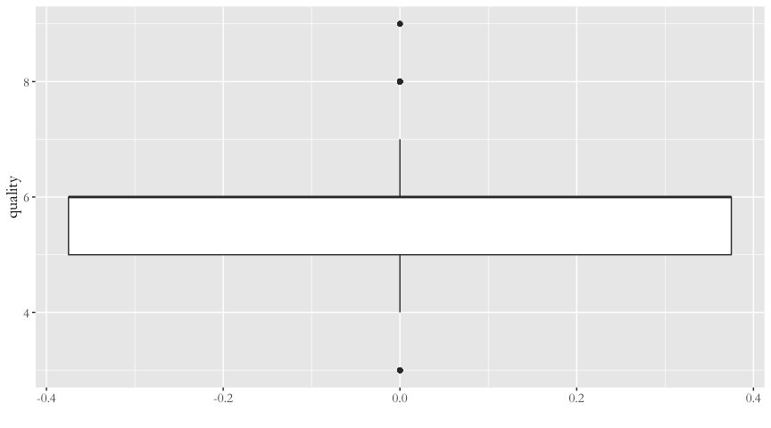
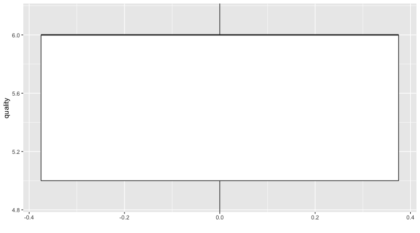
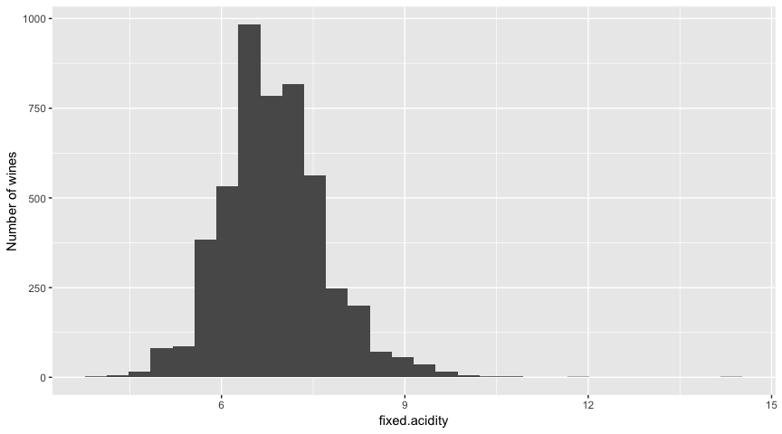

An EDA of White Wine Data by Pranath Fernando
================
Pranath Fernando
November 11th, 2018

An EDA of White Wine Data by Pranath Fernando
=============================================

Introduction
------------

In this exploration I will be examining a data set of white wine data to try to determine which chemical properties of wine may be useful in helping to predict it's quality.

More info on this data set can be found here:

<https://s3.amazonaws.com/udacity-hosted-downloads/ud651/wineQualityInfo.txt>

Some research into the literature regarding chemical factors that can effect wine quality such as:

-   <https://www.researchgate.net/publication/276424645_Prediction_of_Wine_Sensorial_Quality_by_Routinely_Measured_Chemical_Properties>
-   <https://www.hindawi.com/journals/tswj/2012/249041/>
-   <https://naramatawine.files.wordpress.com/2015/03/winemaking-uof-c-davis.pdf>

These suggest that the following chemical factors may play a role in determining wine quality:

-   Sulphur dioxide
-   ph
-   Density
-   Alcohol
-   Non-volatile acids
-   Total acids

These chemical qualities will guide the primary features of interest in the given data set for this exploration.

The dataset consists of 4898 observations of 13 variables which are:

-   **fixed.acidity**
-   **volatile.acidity**
-   **citric.acid**
-   residual.sugar
-   chlorides
-   **free.sulfur.dioxide**
-   **total.sulfur.dioxide**
-   **density**
-   **pH**
-   sulphates
-   **alcohol**
-   **quality**

Variables to be explored highlighted in bold.

Univariate Plots
----------------

``` r
# Load initial libraries install.packages('ggplot2')
library(ggplot2)
# install.packages('GGally')
library(GGally)

# Set seed so results are reproducable
set.seed(1836)

# Load the Data
setwd("/Users/pranath/DataScience/r/eda_project/")
wine <- read.csv("wineQualityWhites.csv")

# Print out data types
str(wine)
```

    ## 'data.frame':    4898 obs. of  13 variables:
    ##  $ X                   : int  1 2 3 4 5 6 7 8 9 10 ...
    ##  $ fixed.acidity       : num  7 6.3 8.1 7.2 7.2 8.1 6.2 7 6.3 8.1 ...
    ##  $ volatile.acidity    : num  0.27 0.3 0.28 0.23 0.23 0.28 0.32 0.27 0.3 0.22 ...
    ##  $ citric.acid         : num  0.36 0.34 0.4 0.32 0.32 0.4 0.16 0.36 0.34 0.43 ...
    ##  $ residual.sugar      : num  20.7 1.6 6.9 8.5 8.5 6.9 7 20.7 1.6 1.5 ...
    ##  $ chlorides           : num  0.045 0.049 0.05 0.058 0.058 0.05 0.045 0.045 0.049 0.044 ...
    ##  $ free.sulfur.dioxide : num  45 14 30 47 47 30 30 45 14 28 ...
    ##  $ total.sulfur.dioxide: num  170 132 97 186 186 97 136 170 132 129 ...
    ##  $ density             : num  1.001 0.994 0.995 0.996 0.996 ...
    ##  $ pH                  : num  3 3.3 3.26 3.19 3.19 3.26 3.18 3 3.3 3.22 ...
    ##  $ sulphates           : num  0.45 0.49 0.44 0.4 0.4 0.44 0.47 0.45 0.49 0.45 ...
    ##  $ alcohol             : num  8.8 9.5 10.1 9.9 9.9 10.1 9.6 8.8 9.5 11 ...
    ##  $ quality             : int  6 6 6 6 6 6 6 6 6 6 ...

``` r
# Print out summary stats for variables
summary(wine)
```

    ##        X        fixed.acidity    volatile.acidity  citric.acid    
    ##  Min.   :   1   Min.   : 3.800   Min.   :0.0800   Min.   :0.0000  
    ##  1st Qu.:1225   1st Qu.: 6.300   1st Qu.:0.2100   1st Qu.:0.2700  
    ##  Median :2450   Median : 6.800   Median :0.2600   Median :0.3200  
    ##  Mean   :2450   Mean   : 6.855   Mean   :0.2782   Mean   :0.3342  
    ##  3rd Qu.:3674   3rd Qu.: 7.300   3rd Qu.:0.3200   3rd Qu.:0.3900  
    ##  Max.   :4898   Max.   :14.200   Max.   :1.1000   Max.   :1.6600  
    ##  residual.sugar     chlorides       free.sulfur.dioxide
    ##  Min.   : 0.600   Min.   :0.00900   Min.   :  2.00     
    ##  1st Qu.: 1.700   1st Qu.:0.03600   1st Qu.: 23.00     
    ##  Median : 5.200   Median :0.04300   Median : 34.00     
    ##  Mean   : 6.391   Mean   :0.04577   Mean   : 35.31     
    ##  3rd Qu.: 9.900   3rd Qu.:0.05000   3rd Qu.: 46.00     
    ##  Max.   :65.800   Max.   :0.34600   Max.   :289.00     
    ##  total.sulfur.dioxide    density             pH          sulphates     
    ##  Min.   :  9.0        Min.   :0.9871   Min.   :2.720   Min.   :0.2200  
    ##  1st Qu.:108.0        1st Qu.:0.9917   1st Qu.:3.090   1st Qu.:0.4100  
    ##  Median :134.0        Median :0.9937   Median :3.180   Median :0.4700  
    ##  Mean   :138.4        Mean   :0.9940   Mean   :3.188   Mean   :0.4898  
    ##  3rd Qu.:167.0        3rd Qu.:0.9961   3rd Qu.:3.280   3rd Qu.:0.5500  
    ##  Max.   :440.0        Max.   :1.0390   Max.   :3.820   Max.   :1.0800  
    ##     alcohol         quality     
    ##  Min.   : 8.00   Min.   :3.000  
    ##  1st Qu.: 9.50   1st Qu.:5.000  
    ##  Median :10.40   Median :6.000  
    ##  Mean   :10.51   Mean   :5.878  
    ##  3rd Qu.:11.40   3rd Qu.:6.000  
    ##  Max.   :14.20   Max.   :9.000

``` r
# Check for NA's
unique(unlist(lapply(wine, function(x) which(is.na(x)))))
```

    ## integer(0)

Our dataset of white wine quality data has 13 variables with 4898 rows/observations (and no NA values)

``` r
# Show boxplot of wine quality values
qplot(y = quality, data = wine, geom = "boxplot") + coord_cartesian() + theme(text = element_text(family = "Garamond", 
    size = 14))
```



``` r
# Show summary stats of wine quality values
summary(wine$quality)
```

    ##    Min. 1st Qu.  Median    Mean 3rd Qu.    Max. 
    ##   3.000   5.000   6.000   5.878   6.000   9.000

Wine quality scores are discrete integer values, ranging from 3 to 9. The distribution of these values seems approximately normal and fairly even around the center.

Most wines wines (IQR) have qualities that range between 5 and 6, so quite a narrow range in the mid range (ie near the median of 6) which also implies that very few wines get an exceptionally low or high score for quality.

The box plot also illustrates that the mean & median (2nd qartile) are both almost the same as the 3rd Quartile. This might be explained when we consider in the histogram around 2250 (nearly half) of wines have a quality of 6 alone.

Focussing on the bulk of the distribution...

``` r
# Show boxplot of wine quality values - focussed on IQR
qplot(y = quality, data = wine, geom = "boxplot") + coord_cartesian(ylim = c(4.85, 
    6.15))
```



This also shows more clearly how most wines have a quality less than 6, and many of these wines have a quality of exactly 6 (with 2nd quartile equal to 3rd quartile).

In a way, quality is very much a categorical variable - we will create a new field later which has quality as this type of variable.

Lets look at fixed.acidity.

``` r
# Show histogram of fixed acidity values
qplot(x = fixed.acidity, data = wine) + ylab("Number of wines")
```



``` r
# Show summary stats of fixed acidity values
summary(wine$fixed.acidity)
```

    ##    Min. 1st Qu.  Median    Mean 3rd Qu.    Max. 
    ##   3.800   6.300   6.800   6.855   7.300  14.200
